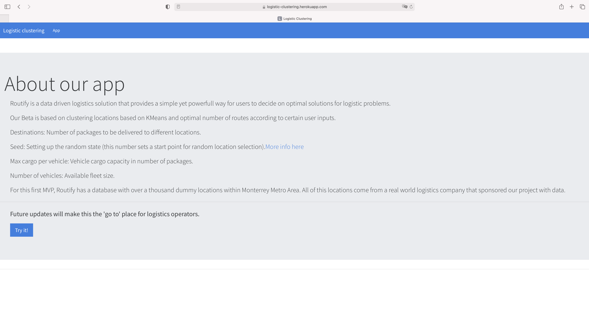
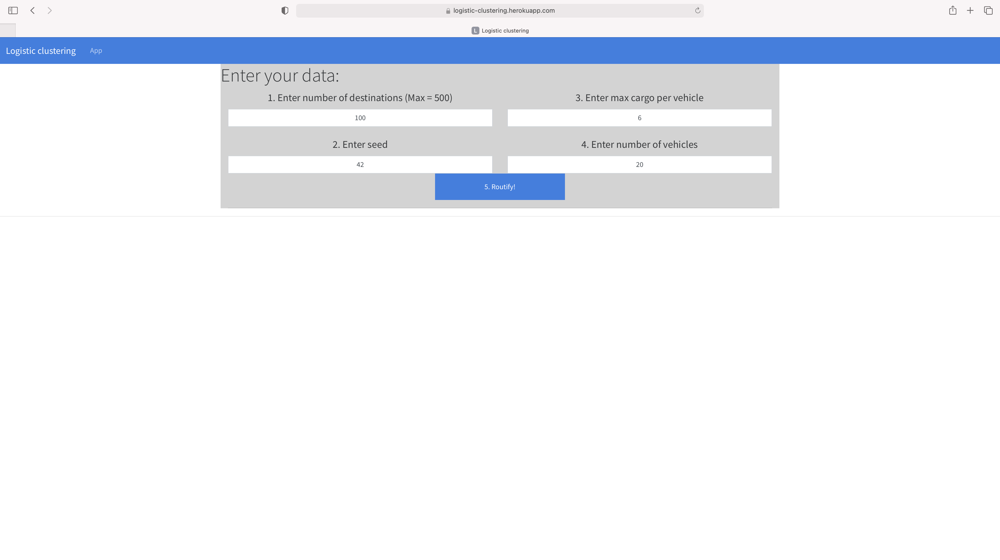

# Route Automation with Clustering
The app provide a practical and low cost solution for optimizing routes to any last mile delivery company using Machine Learning, based on total deliveries, available vehicles and cargo capacity.

## Description

1. Clustering.js

Use clustering.js to build a clustered map based on total deliveries, available vehicles and cargo capacity entered. Each displayed route is coloured with a different color.

2. Heroku

Deploy the Flask App to Heroku

  * Use the heroku postgres add on
  * Use the provided schema.sql to create the tables.
  * Use the option Import/Export of the table to import the data from the data.csv file

3. Flask API

Use app.py to serve the data needed for the map

  * Test the route in the browser: 

  https://logistic-clustering.herokuapp.com/api/map/size/seed/cargomax/vehicles
  
  * The route was created to extract the destinations from the DB and implement the   k-means logic, it creates, fits the model and predicts the clusters.

4. Heroku Deployment

<https://logistic-clustering.herokuapp.com>

## Screenshots

### Home page

### App page

Enter the number of destinations, the maximum cargo per vehicle, the total number of available vehicles and the seed… and Routify!!!

You will get the optimized routes to follow 

## Team members

1. Cristobal Bugeda
2. Eduardo Garza
3. Ana Laura Pérez
4. Cintia Mercado

